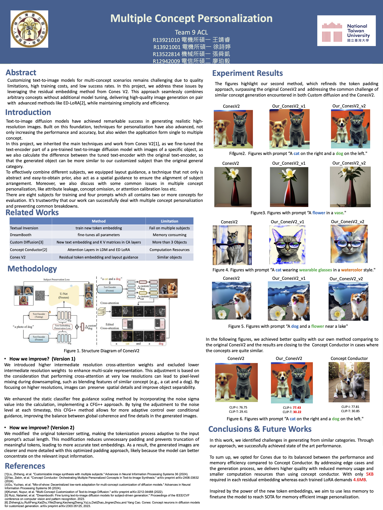

# Multiple Concept Personalization
This project aims to reach the goal of multiple concept personalization task. Not only do we pursue the high performance of our experiment results, but also the balance between computational cost and quality.



# Usage
To start working on this project, you should clone this repository into your local machine by using the following command.
```bash
git clone https://github.com/RayWang1226/Multiple-Concept-Personalization.git
```
# Environment Setup
This work should be completed using Python 3.9.21. Create a environment under conda
```bash
conda create -n multi_concept python=3.9.21 -y
conda activate multi_concept
```
Install the environment with pip and requirements.txt, note that the version of pytorch should match your CUDA version.
```bash 
pip install -r requirements.txt
```
```bash
accelerate config default
```
Get the dataset with
```bash
bash get_dataset.sh
```
# Training
We wrote the bash script that can train the concepts for the tasks, by simply run 
```bash
bash training_all.sh
```
The tuned parameters for the concept will be store in the specific folder assign in the .sh

# Inference
As our inference need a layout and the model need to know the specific trained embedding for the concept, we assign the json and the layout image for the prompt individualy
```bash 
bash inference_all.sh
```
When the inference information and the path to the layout image are written in the output(1~4).json
Remember to provide a pre-defined layout and a json file with the info about the details of the inference settings. The 
json file should include the following information:

- "prompt": the text prompt you want to generate.
- "residual_dict": the paths to all the required residual embeddings.
- "color_context": the color information of different regions in the layout and their corresponding subjects, along with 
the weight for strengthening the signal of target subject. (default: 2.5).
- "guidance_steps": the number of steps of the layout guidance.
- "guidance_weight": the strength of the layout guidance (default: 0.08, we recommond 0.05 ~ 0.10).
- "weight_negative": the weight for weakening the signal of irrelevant subject.
- "layout": the path to user-defined layout image.
- "subject_list": the list containing all the subjects to be customized and their corresponding positions in the prompt.

# Acknowledgement

This project extends the work of [**Cones V2**](https://github.com/ali-vilab/Cones-V2) by Liu *et al.*, titled **"Cones 2: Customizable Image Synthesis with Multiple Subjects"**, available on arXiv.  
We thank the authors for their excellent contributions and for open-sourcing their code.

# Citation

If you use methods or code from Cones V2, please cite their paper:

```bibtex
@article{liu2023cones2,
  title     = {Cones 2: Customizable Image Synthesis with Multiple Subjects},
  author    = {Zhiheng Liu and Yifei Zhang and Yujun Shen and Kecheng Zheng and Kai Zhu and Ruili Feng and Yu Liu and Deli Zhao and Jingren Zhou and Yang Cao},
  journal   = {arXiv preprint arXiv:2305.19327},
  year      = {2023},
  doi       = {10.48550/arXiv.2305.19327}
}
